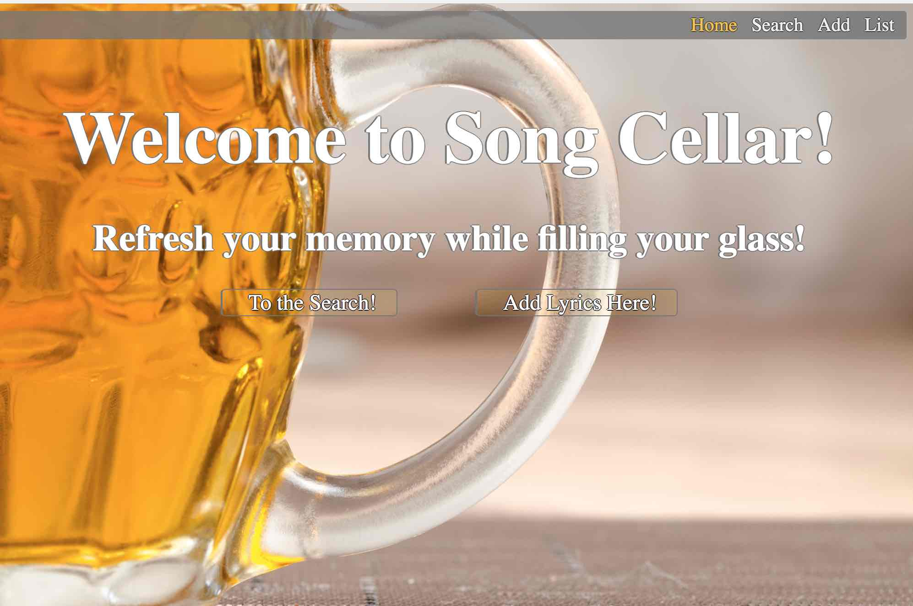

# Welcome to Song Cellar!

## Refresh your memory while filling your glass!

Pub sings are great fun, but sometimes song leaders need a little help...
especially when the beer is flowing!

Want to sing someone else's song, but don't know the words?

Been asked to sing an 'old favorite' but can't remember how it starts?

Want to review a song before a night out?

### Never fear, Song Cellar is here!

## Song Cellar is an easy place to store and locate song lyrics for pub sings.

## Technology Used

Song Cellar is a fullstack application that was developed in an environment utilizing Visual Studio Code, git, and Github.

The front-end client was written using Javascript, jQuery, HTML and CSS.

Our server utilized Node.js with Express to create endpoints and routers.

We used Mocha and Chai for testing, as well as Faker to generate some of our test data.

For data persistence, we used MongoDB along with Mongoose.

mLab is hosting our database on the web while Heroku hosts the Song Cellar itself. We used TravisCI for continuous integration and testing. 

You can visit the Song Cellar at:

https://david-scott-node-capstone.herokuapp.com/

